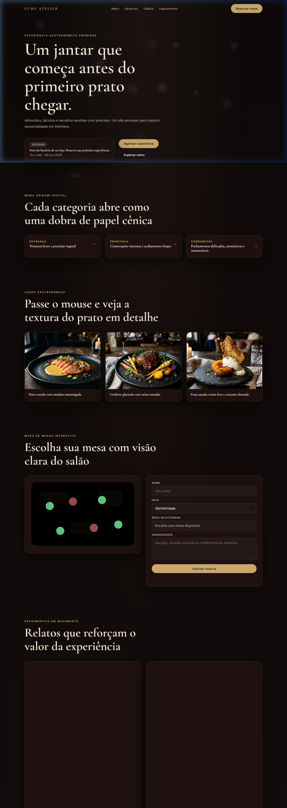

# Lume Atelier

> Site conceitual de restaurante fine dining experiencial — construído com HTML5, CSS3 e JavaScript vanilla, sem dependências de build. Deploy-ready para Vercel, Netlify ou GitHub Pages.

## Preview



## Sobre o Projeto

**Lume Atelier** é uma peça que explora a interseção entre design editorial e interface web. O objetivo é traduzir a sensorialidade de um jantar fine dining em uma experiência de navegação sofisticada — sem frameworks, sem dependências, apenas HTML semântico, CSS avançado e JavaScript moderno.

## Tecnologias Utilizadas

- **HTML5 semântico** — estrutura acessível com roles ARIA e atributos corretos
- **CSS3** — custom properties, clamp(), grid, backdrop-filter, keyframes e responsividade mobile-first
- **JavaScript vanilla (ES2021)** — IntersectionObserver, Canvas 2D, eventos de pointer
- **Google Fonts** — Cormorant Garamond (headings) + Inter (UI)
- **SVG inline** — mapa de mesas do salão

## Funcionalidades

- [x] Hero com partículas de vapor animadas em Canvas 2D
- [x] Badge de aberto/fechado calculado em tempo real
- [x] Menu origami com dobras 3D e acessibilidade ARIA
- [x] Galeria com lupa circular para inspecionar textura dos pratos
- [x] Mapa de mesas interativo em SVG com tooltips
- [x] Formulário de reserva com validação e feedback de envio
- [x] Depoimentos com Ken Burns e efeito typewriter via IntersectionObserver
- [x] Navegação mobile com hamburger menu (abre/fecha com Escape e overlay)
- [x] Header sticky com efeito glassmorphism ao rolar
- [x] Design responsivo — 320px, 768px e 1440px+
- [x] Suporte a `prefers-reduced-motion`
- [x] Foco visível e navegação por teclado (WCAG AA)

## Como Rodar Localmente

O projeto não possui dependências de build. Basta servir os arquivos estáticos:

```bash
# Clone o repositório
git clone https://github.com/usuario/lume-atelier.git
cd lume-atelier
```

## Autor

Projeto preparado para apresentação pública de portfólio.

## Licença

~~
