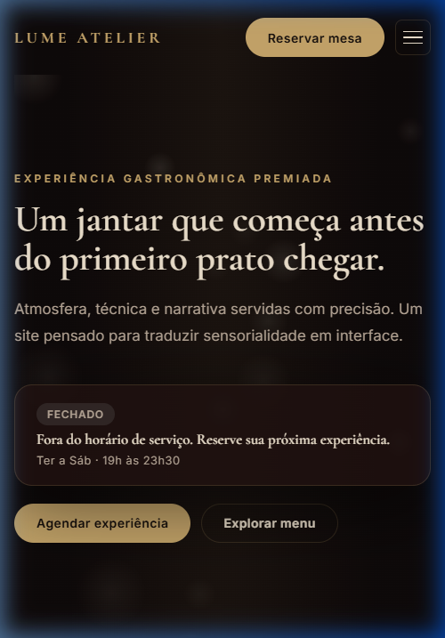

# Lume Atelier

> Site conceitual de restaurante fine dining experiencial — construído com HTML5, CSS3 e JavaScript vanilla, sem dependências de build. Deploy-ready para Vercel, Netlify ou GitHub Pages.

## Preview

<!-- Capturas geradas após primeira execução local -->



## Sobre o Projeto

**Lume Atelier** é uma peça de portfólio front-end que explora a interseção entre design editorial e interface web. O objetivo é traduzir a sensorialidade de um jantar fine dining em uma experiência de navegação sofisticada — sem frameworks, sem dependências, apenas HTML semântico, CSS avançado e JavaScript moderno.

**Público-alvo:** Recrutadores e clientes que avaliam qualidade de código front-end, domínio de CSS, acessibilidade e atenção ao detalhe visual.

## Tecnologias Utilizadas

- **HTML5 semântico** — estrutura acessível com roles ARIA e atributos corretos
- **CSS3** — custom properties, clamp(), grid, backdrop-filter, keyframes e responsividade mobile-first
- **JavaScript vanilla (ES2021)** — IntersectionObserver, Canvas 2D, eventos de pointer
- **Google Fonts** — Cormorant Garamond (headings) + Inter (UI)
- **SVG inline** — mapa de mesas do salão

## Funcionalidades

- [x] Hero com partículas de vapor animadas em Canvas 2D
- [x] Badge de aberto/fechado calculado em tempo real
- [x] Menu origami com dobras 3D e acessibilidade ARIA
- [x] Galeria com lupa circular para inspecionar textura dos pratos
- [x] Mapa de mesas interativo em SVG com tooltips
- [x] Formulário de reserva com validação e feedback de envio
- [x] Depoimentos com Ken Burns e efeito typewriter via IntersectionObserver
- [x] Navegação mobile com hamburger menu (abre/fecha com Escape e overlay)
- [x] Header sticky com efeito glassmorphism ao rolar
- [x] Design responsivo — 320px, 768px e 1440px+
- [x] Suporte a `prefers-reduced-motion`
- [x] Foco visível e navegação por teclado (WCAG AA)

## Estrutura de Pastas

```text
.
├── index.html
├── README.md
└── src/
    ├── images/
    │   ├── prato-01.png
    │   ├── prato-02.png
    │   ├── prato-03.png
    │   ├── cliente-01.png
    │   └── cliente-02.png
    ├── scripts/
    │   └── main.js
    └── styles/
        └── main.css
```

## Como Rodar Localmente

O projeto não possui dependências de build. Basta servir os arquivos estáticos:

```bash
# Clone o repositório
git clone https://github.com/usuario/lume-atelier.git
cd lume-atelier

# Opção 1 — Python (sem instalação)
python -m http.server 8082

# Opção 2 — Node.js
npx serve .

# Acesse no navegador
# http://localhost:8082
```

## Validação

```bash
# Checar sintaxe JS sem executar
node --check src/scripts/main.js
```

## Decisões Técnicas

- **Estático puro:** Sem bundler ou framework, facilitando deploy em qualquer CDN/hosting estático.
- **CSS em arquivo único:** Tokens visuais centralizados em custom properties para consistência total.
- **JS em arquivo único:** Escopo claro, sem dependências externas — cada feature é um bloco comentado.
- **Canvas 2D com baixa densidade de partículas:** Preserva fluidez em dispositivos de entrada.
- **IntersectionObserver no typewriter:** Garante que o efeito só dispare quando o usuário vê o elemento.
- **Hamburger menu nativo:** Acessível via teclado (Tab, Enter, Escape), sem bibliotecas.

## Melhorias Futuras

- [ ] Implementar backend real para o formulário de reserva (ex: Formspree ou Resend)
- [ ] Adicionar modo de alto contraste (`prefers-contrast: more`)
- [ ] Criar página de menu completo com filtros por categoria e restrição alimentar

## Licença

Este projeto está sob a licença [MIT](./LICENSE).

---

Desenvolvido como peça de portfólio front-end.
